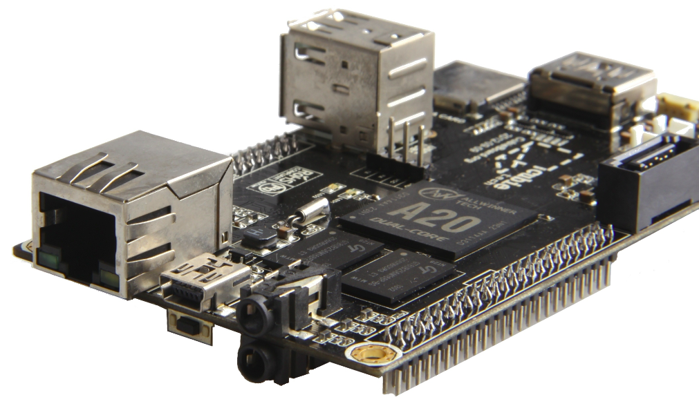

Cubiebook 2 - The Missing Cubieboard Manual
=========================================

* [版权声明](copyright.md)

* [前言](chapter0/README.md)

* [Chapter1：遇见cubieboard2](chapter1/README.md)

	[介绍cubieboard2的硬件组成和接口情况](chapter1/introduction/introduction.md)

	[如何开始使用cubieboard2](chapter1/get_started/get_started.md)

	[如何给cubieboard2恢复系统/刷机](chapter1/update/update.md)

* [Chapter2：使用cubieboard2](chapter2/README.md)

	用cubieboard2把电视变成android TV

	使用XBMC for Android媒体中心

	给cubieboard2安装Linux

* [Chapter3：把cubieboard2当作开发平台](chapter3/README.md)
	
	[从头构建 CubieBoard2 Debian系统](chapter3/debian/debian.md)

	[使用buildroot构建自己的linux系统](chapter3/linux/buildroot.md)

* [Chapter4：cubieboard2硬件hack](chapter3/README.md)

